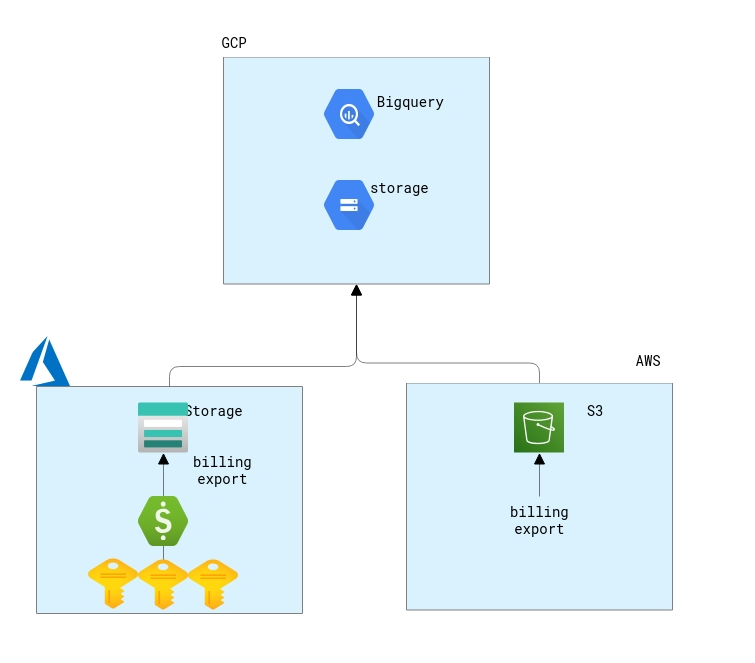

### Agenda
 1. グループ発表
 2. ハンズオンのコンテンツ
 3. アカウント/リソース管理方針

---

### ハンズオンのコンテンツ

---

募集時の時よりももう少しやること詳細化しました。  
もちろん全てできなくてもOKです。

---

#### テーマ1: AP構築実践
- オンプレ（ローカルマシン）でも動作するAPを実装して**クラウドへシフト＆リフト**してみる。

---

#### 1. APの実装
  - ローカルマシンでも動作する簡単なWebAPを作成する。
    - スキルを伸ばしたい言語や普段使わない好きな言語でやってみてください。
    - 個人の実力に合わせて連携するDBやQueueなど増やしてみてください。その方が後々面白いと思います。
    - 苦戦しそうな方はプログラムだけで動作するAPでもOKです。

---

#### 2. IaaSへのAPリフト
  - クラウドのVMにWebAPをデプロイする。
    - AWS: Elastic Compute Cloud
    - Azure: Virtual Machine
    - GCP: Compute Engine
  - はい。デプロイ先のVM（NWも必要）も作ってください。

---

#### 3. PaaSへのAPシフト
  - クラウドのPaaSサービスへAPをデプロイする。
    - AWS: Elastic Bean Stalk
    - Azure: App Service
    - GCP: App Engine
  - APを多少改修しないと動かないかも。

---

#### 4. FaaSへのAPシフト
  - クラウドのFaaSサービスへAPをデプロイする。
    - AWS: Lambda
    - Azure: azure Functions
    - GCP: Cloud Function
 - 言語によっては完全に作り直しが必要かも。

---

#### 5. APのコンテナモダナイズ
  - 最初に作成したAPをコンテナとして起動できるようコンテナイメージ化する。
  - docker/Dockerfileでbuildしてみてください。
  - せっかくなので、クラウドのコンテナレジストリへイメージをpushしましょう。

---

#### 6. クラウドコンテナサービスへのデプロイ
  - 作成したイメージをコンテナサービスへデプロイする。
    - AWS: Elastic Container Service
    - Azure: Container Instance
    - GCP: Cloud Run

---

#### 7. Kubernetesへのデプロイ
  - 余裕がある方はコンテナオーケストレーションであるkubernetesにもデプロイしてみてください。
    - AWS: EKS
    - Azure: AKS
    - GCP: GKE

---

ここまでできればもう立派なシフト＆リフトができたかと思います。

---

これまでやってきたAPのビルド、コンテナ化、デプロイを自動化してみましょう。

---

#### 8. ビルドデプロイの自動化
  - 好きなツールを使って自動化してみましょう。参考までにクラウドが提供しているのは以下
    - AWS: CodePipeline / CodeCommit / CodeBuild / CodeCommit / Codedeploy
    - Azure:  Azure Devops
    - GCP: Cloud Source Repository / Cloud Build

---

#### テーマ2: インフラ構築実践
- クラウドにおけるIaaSを中心とした高可用性環境を構築してみる。
- いけるグループは可用性だけでなくパフォーマンス、セキュリティ、監視など手広にいきましょう。
- そしてこの構成をコード化して自動構築できるようにしてみる。

>>>

PaaSやSaaSは既にマネージドサービスであるが故に高可用性な構成になっています。  
なのでお金さえ払えばオプションで高可用性な構成が利用できちゃいます。

>>>

IaaSはインフラの構成からセルフで作成する必要があります。  
なので、クラウドにおける開発でIaaSを利用する場合は非機能設計と構築が欠かせません。
もちろんPaaSとかも組み合わせてみてください。

---

#### 1. インフラ設計
  - まずはグループ毎に絵を書いてみましょう。
  - どのクラウドでも全部でも構いません。
  - 基本的に正解はないので、気楽に書きましょう。

>>>

AWSのサイトですが、考え方はクラウド共通なのでどのベンダでも考慮すべき点は同じです。  
[参考サイト:AWS Well-Architected framework](https://aws.amazon.com/jp/blogs/news/aws-well-architected-whitepaper/)

>>>

CloudSkewで絵描きましょう。これすごい  
[参考サイト：CloudSkew](https://www.cloudskew.com/)

>>>

試しに書いてみた。いい感じ  

---

#### 2. インフラ構築
  - 設計した内容で実際に構築してみましょう。

---

#### 3. インフラのコード化
  - 構築したインフラをコード化しましょう。
    - AWS: CloudFormation
    - Azure: Resource Deployment
    - GCP: Deployment Manager
  - 誰かクラウドネイティブなコード化ツールであるTerraformを使ってみて！
